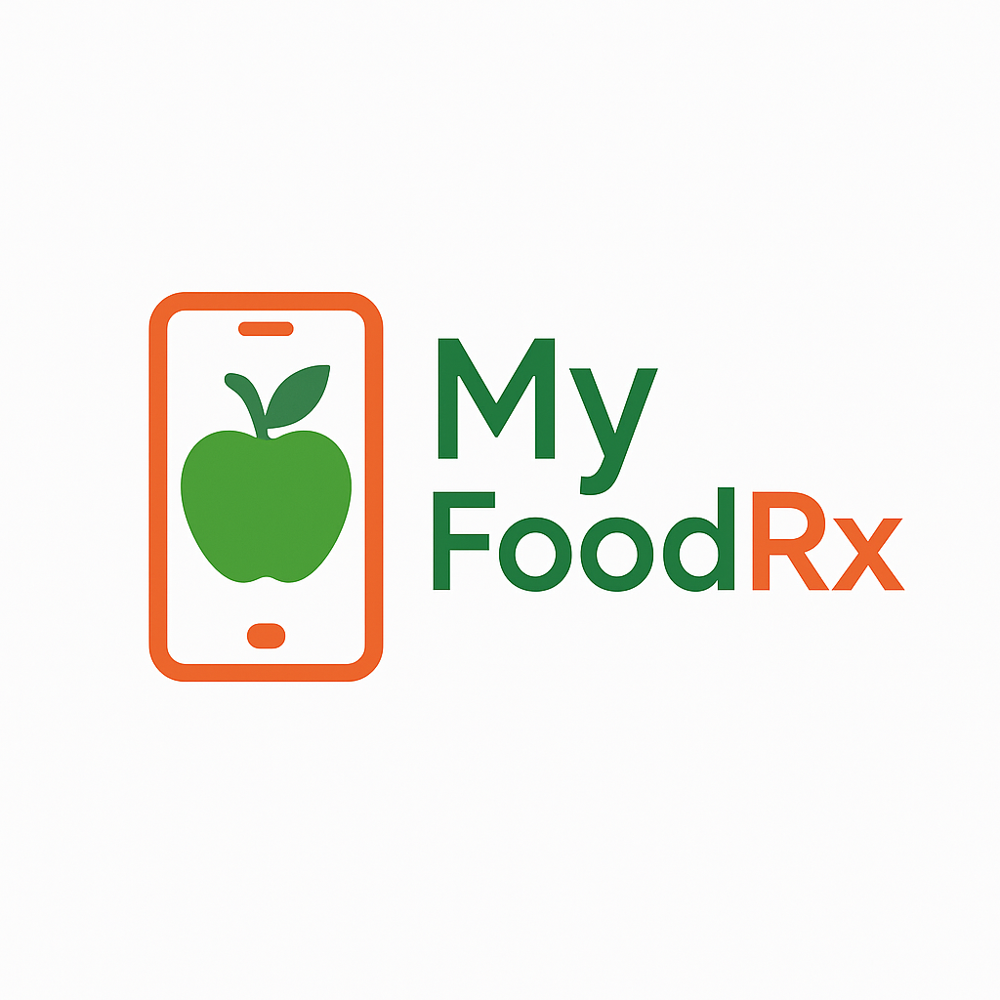

# MyFoodRx: Personalized Food-as-Medicine Mobile Application

<p align="center">
  
</p>

**MyFoodRx** is a mobile food-as-medicine application built with Flutter and FastAPI, designed for food-insecure adults living with chronic conditions such as diabetes, hypertension, and obesity. It combines personalized diet planning, smart recipe generation, pantry management, daily health tracking, and a RAG-powered nutrition chatbot into one seamless experience.

---

## ✨ Features

- **🍎 Personalized Diet Plans**: Get a tailored diet plan (Diabetes Plate, DASH, or MyPlate) based on a detailed onboarding process that captures your health goals, medical conditions, and dietary preferences.
- **🧑‍🍳 Smart Recipe Generation**: Discover recipes you can make right now. The app analyzes your pantry, prioritizes expiring ingredients, and filters recipes based on your specific health needs (e.g., low-sodium, low-sugar).
- **📝 Pantry Management**: Easily track your food inventory. Add items to your virtual pantry, categorize them, and get reminders for expiring goods.
- **🎯 Daily & Weekly Health Tracking**: Stay on top of your goals with a dashboard that tracks your daily intake of water, vegetables, protein, and other essential nutrients.
- **📚 Educational Content**: Browse and bookmark articles on nutrition, healthy eating, and managing health conditions.
- **🤖 RAG Nutrition Chatbot**: An AI-powered chatbot grounded in a curated 63-document, 8-category nutrition knowledge base. Built with Gemini embeddings, ChromaDB vector storage, and a three-layer safety guard (emergency redirection, relevance gating, and a hardened plan-aware system prompt). Delivers personalized, plan-consistent nutrition guidance written at a 2nd–3rd grade reading level.
- **🔐 Secure Authentication**: Your data is protected with secure user authentication and JWT-based authorization.

---

## 🛠️ Tech Stack & Architecture

MyFoodRx is built with a modern stack designed for scalability and a smooth user experience.

| Layer | Technology |
|---|---|
| Frontend | Flutter |
| State Management | Provider |
| Backend API | FastAPI (Python 3.10+) |
| Database | MongoDB Atlas |
| RAG Embeddings | Google Gemini (`gemini-embedding-001`) |
| RAG Generation | Google Gemini (`gemini-2.5-flash` with fallbacks) |
| Vector Store | ChromaDB (persistent, local) |
| Food Data & Recipes | Spoonacular API |
| RAG Generation Fallback | Groq (`llama-3.3-70b-versatile`) — auto-activated on Gemini quota exhaustion |
| RAG Evaluation | LLM-as-judge evaluation (Groq llama-3.3-70b, 40 questions, 8 categories) |
| iOS CI | Xcode Cloud |

The project follows a **feature-first architecture** where code is organized by feature (e.g., `auth`, `recipes`, `pantry`, `chatbot`). The RAG service uses a facade pattern — `rag_service.py` is the single public entry point, backed by 9 focused sub-modules under `backend/app/services/rag/` (constants, security, query classifier, profile helpers, prompt builder, cache, chunker, and response helpers). Only `rag_service.py` is permitted to call Gemini APIs.

---

## 🤖 RAG Chatbot Architecture

The chatbot is implemented as a four-layer system:

```
Flutter UI (ChatbotPage)
    → POST /chatbot/chat (FastAPI)
        → rag_service.py  [facade over 9 sub-modules in services/rag/]
            Layer 1: Regex/rule-based safety classification
            Layer 2: ChromaDB retrieval + cosine similarity gating
            Layer 3: Gemini generation (Groq fallback on quota exhaustion)
        → MongoDB (conversation history + chip rotation + response cache)
```

**Knowledge base:** 63 curated nutrition documents across 8 categories — Sleep, Exercise, Hydration, Hypertension, Pre-Diabetes, Diabetes, Obesity, and General — sourced from CDC, NIH, AHA, ADA, USDA, FDA, and Harvard T.H. Chan School of Public Health.

**Personalization:** Every response is conditioned on the user's resolved diet plan (Diabetes Plate, DASH, or MyPlate), conditions, pantry inventory, and server-side conversation history persisted in MongoDB. Multi-condition users (e.g. diabetes + hypertension) receive blended guidance that respects constraints from all active conditions simultaneously.

---

## 📊 RAG Evaluation

The chatbot retrieval pipeline was evaluated using a 40-question held-out test set (5 questions per category) scored across three metrics: faithfulness, answer relevancy, and context precision.

| Metric | Score |
|---|---|
| Faithfulness | 0.868 |
| Answer Relevancy | 0.945 |
| Context Precision | 0.830 |

**Per-category breakdown:**

| Category | Faithfulness | Relevancy | Precision |
|---|---|---|---|
| Sleep | 0.900 | 0.980 | 0.880 |
| General | 0.860 | 0.980 | 0.860 |
| Obesity | 0.860 | 0.960 | 0.880 |
| Exercise | 0.860 | 0.960 | 0.850 |
| Hydration | 0.880 | 0.980 | 0.830 |
| Diabetes | 0.860 | 0.900 | 0.780 |
| Hypertension | 0.860 | 0.900 | 0.780 |
| Pre-Diabetes | 0.860 | 0.900 | 0.780 |


> **Note:** Evaluation uses an offline pipeline (Groq `llama-3.3-70b-versatile`) over the same ChromaDB retrieval layer used by the chatbot. Scores measure retrieval quality and knowledge base coverage. Scores should be re-run after knowledge base updates or retrieval pipeline changes.

To run the evaluation yourself:

```bash
cd backend
python3 evaluation/run_rag_eval.py                        # all 40 questions
python3 evaluation/run_rag_eval.py --category Sleep       # single category
```

Reports are saved to `backend/evaluation/reports/`.

---

## 🚀 Getting Started

### 1. Prerequisites

- Flutter SDK (version >=3.35.3 <4.0.0)
- An IDE (VS Code or Android Studio) with the Flutter plugin
- Python 3.10+ and pip3
- Install Ruby using Homebrew:
  ```bash
  brew install ruby
  echo 'export PATH="/opt/homebrew/opt/ruby/bin:$PATH"' >> ~/.zshrc
  source ~/.zshrc
  ```
- Install CocoaPods:
  ```bash
  gem install cocoapods
  ```
- Access to:
  - A MongoDB Atlas database
  - A Spoonacular API key
  - A Google Gemini API key
  - A Groq API key

### 2. Clone the Repository

```bash
git clone https://github.com/jariwala-jay/food-rx-app.git
cd food-rx-app
```

### 3. Install Flutter Dependencies

```bash
flutter pub get
```

### 4. Configure Environment Variables

Create a `.env` file in the root of the project:

```env
# Backend API
API_BASE_URL=http://127.0.0.1:8000        # local dev
# API_BASE_URL=http://10.0.2.2:8000       # Android emulator
# API_BASE_URL=http://localhost:8000       # iOS simulator

# Backend server config
MONGODB_URL="mongodb+srv://<user>:<password>@<cluster>.mongodb.net/?retryWrites=true&w=majority"
SECRET_KEY=<your-secret-key-at-least-32-characters>
API_HOST=0.0.0.0
API_PORT=8000

# API Keys
GEMINI_API_KEY="your-gemini-api-key"
GROQ_API_KEY="your-groq-api-key"
RAPID_API_KEY="your-spoonacular-rapid-api-key"

# Email service
GMAIL_USER="your-gmail@gmail.com"
GMAIL_APP_PASSWORD="your-16-char-app-password"
APP_URL=foodrx://reset-password
EMAIL_FROM_NAME=MyFoodRx

# Feature flags
SHOW_SCALING_CONVERSION=false
MANDATORY_PLAN_VIDEO=false
DEBUG=false

# Video URLs (hosted in Firebase Storage)
DASH_VIDEO_URL="https://firebasestorage.googleapis.com/..."
MYPLATE_VIDEO_URL="https://firebasestorage.googleapis.com/..."
DIABETES_PLATE_VIDEO_URL="https://firebasestorage.googleapis.com/..."
DASH_VIDEO_URL_FULL="https://firebasestorage.googleapis.com/..."
MYPLATE_VIDEO_URL_FULL="https://firebasestorage.googleapis.com/..."
DIABETES_PLATE_VIDEO_URL_FULL="https://firebasestorage.googleapis.com/..."

# Misc
TRACKER_RESET_SECRET=<your-long-random-secret>
ADMIN_PASSWORD=<your-admin-password>
```

> **Note**: The `.env` file is listed in `.gitignore` and should never be committed to your repository.

### 5. Backend Setup

```bash
cd backend
pip3 install -r requirements.txt
uvicorn app.main:app --reload --host 0.0.0.0 --port 8000
```

On first startup, the RAG service will embed all 177 knowledge chunks and store them in ChromaDB (`backend/app/knowledge/chroma_db/`). Subsequent restarts load from ChromaDB instantly with no API calls.

API docs: http://localhost:8000/docs

### 6. Run the Application

```bash
flutter run
```

---

## 📁 Project Structure

```
food-rx-app/
├── lib/
│   └── features/
│       ├── auth/
│       ├── chatbot/
│       │   ├── services/
│       │   │   └── rag_chatbot_service.dart   # Flutter chatbot client
│       │   └── views/
│       │       └── chatbot_page.dart
│       ├── recipes/
│       ├── pantry/
│       └── ...
├── backend/
│   ├── app/
│   │   ├── services/
│   │   │   ├── rag_service.py                 # public facade
│   │   │   ├── conversation_history_service.py
│   │   │   └── rag/                           # 9 focused sub-modules
│   │   │       ├── constants.py
│   │   │       ├── security.py
│   │   │       ├── query_classifier.py
│   │   │       ├── profile_helpers.py
│   │   │       ├── prompt_builder.py
│   │   │       ├── cache.py
│   │   │       ├── chunker.py
│   │   │       └── response_helpers.py
│   │   ├── routers/
│   │   │   ├── chatbot.py
│   │   │   ├── question_banks.py              # starter + follow-up pools
│   │   │   └── suggestion_engine.py           # chip selection + rotation
│   │   └── knowledge/
│   │       ├── food_knowledge.py
│   │       └── chroma_db/
│   ├── evaluation/
│   │   ├── run_rag_eval.py
│   │   ├── test_questions.json
│   │   └── reports/
│   └── requirements.txt
└── .env
```

---

## 📖 Wiki & Documentation

For a deeper dive into the app's architecture, feature implementation, and backend services, visit our **[Project Wiki](https://github.com/jariwala-jay/food-rx-app/wiki)**.